# DeadRising
메타버스 아카데미 2차 프로젝트(2022.7.26 ~ 2022.8.28)  

## 게임 시연 영상
* Youtube 링크  
  
    [](https://youtu.be/BcmCwdvn-R0)  
      
##  게임  
  * **DEAD RISING**   
    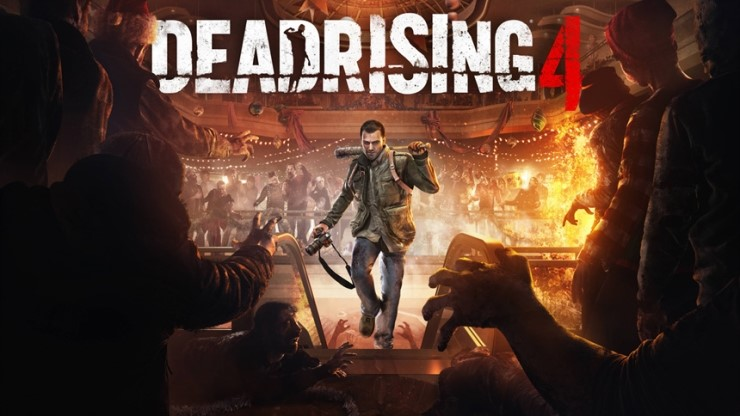  

## 팀 구성 및 역할
   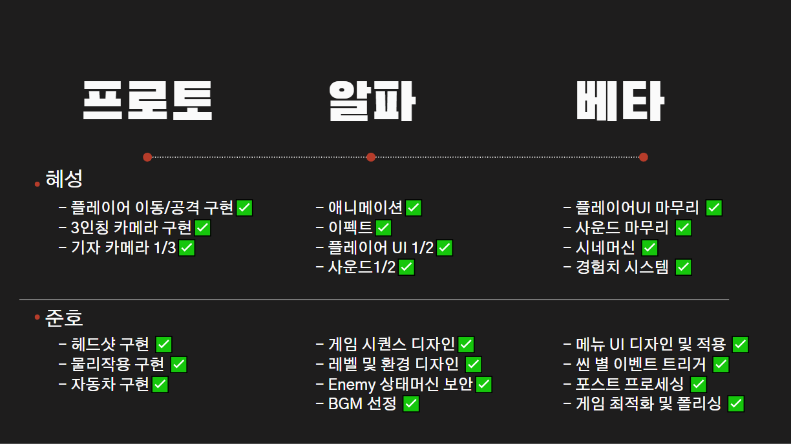  

## 게임 시퀀스
  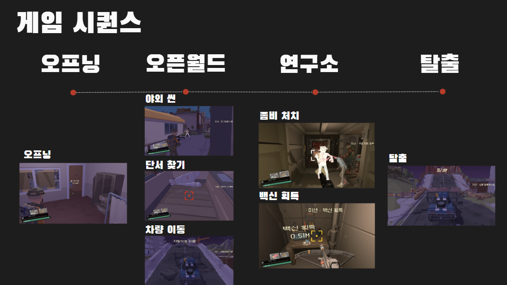  

## 사용 에셋
  * **[POLYGON Apocalypse](https://assetstore.unity.com/packages/3d/environments/urban/polygon-apocalypse-low-poly-3d-art-by-synty-154193)**  
    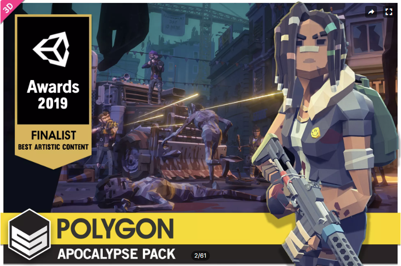</img>  

----
# 주요 구현 요소(김혜성)

## 시네마틱 영상

* **시네머신**  

  * 오프닝 씬  
    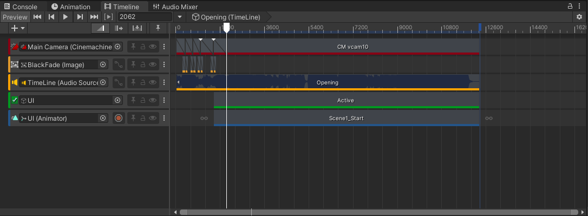</img>  

  * 엔딩 크레딧  
    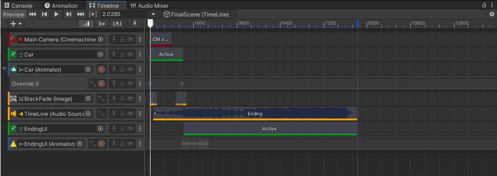</img>  
  
## 플레이어

* **플레이어 모델**  
    
    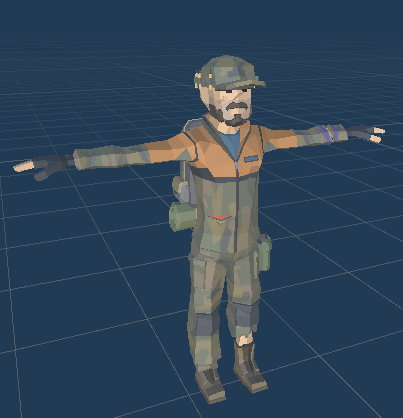</img>  
* **무기 모델** : (왼쪽부터) 일반 석궁, 폭탄 석궁, 기관총  
  
    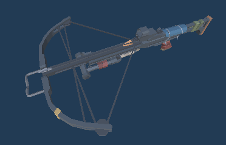</img> 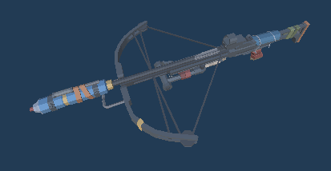</img> </img>    


## 애니메이션 : 캐릭터 애니메이션 & Rig 애니메이션 
  * **캐릭터 애니메이션**  
    *  **Root Motion 사용**  
      *  이전 프로젝트에서는 애니메이션과 위치 이동을 따로 구현하였는데 이번 프로젝트에서는 Root Motion 사용  
      *  Root Motion이 적용된 애니메이션은 애니메이션과 이동속도가 싱크가 맞게 만들어져 있어서 보다 자연스러운 이동 구현 가능  
          (ex 기존에는 발걸음을 옮기기 전인데도 불구하고 위치 이동, 하지만 RootMotion 적용시 정확히 발걸음을 옮겼을시 이동)   
          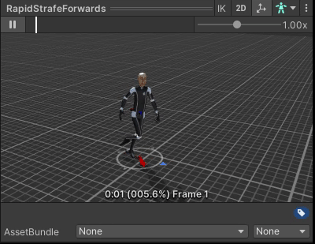</img>   
      *  **사전 작업**  
          * 유니티에서 제공하는 애니메이션 콜백함수인 void OnAnimatorMove() 구현  
            ```C#
            private void OnAnimatorMove()
            {
                rootMotion += animator.deltaPosition;
            }
            ```
           *  그리고 (Vector3)rootMotion에 적절한 값을 곱해준후 CharacterController.Move로 해당 값만큼 이동 후 0으로 초기화 시켜준다.(누적 방지)
              ```C#
              private void UpdateOnGround()
              {   
                  Vector3 stepForwardAmount = rootMotion* groundSpeed;
                  //중력
                  Vector3 stepDownAmount = Vector3.down * stepDown;

                  cc.Move(stepForwardAmount + stepDownAmount);
                  rootMotion = Vector3.zero;
              }
              ```  
    *  **Base Layer** : 걷기, 뛰기, 점프  
        *  **Animator**  
          
            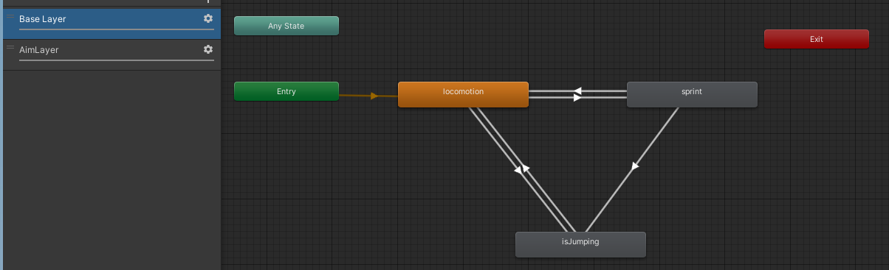</img>  
        * **Unity Blend Tree** : 걷기, 뛰기 State는 Blend Tree로 구성되어 방향키에 따라 자연스러운 움직임  
         
            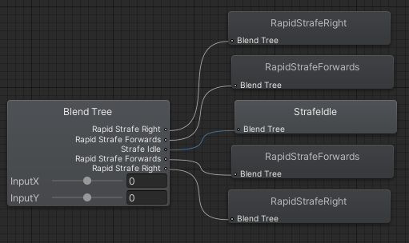</img>  
    *  **Aim Layer** : 조준시 카메라 줌 인/줌 아웃  
        *  **Animator**  
          
            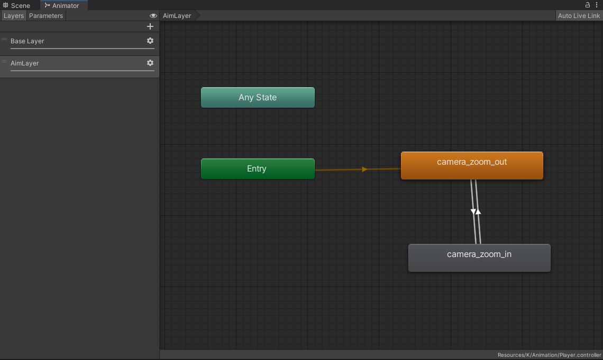</img>  
            
  * **Rig 애니메이션**  
    * **개요**
      *  장착한 무기에 따라 캐릭터의 팔 애니메이션이 다르고 무기와 함께 팔이 움직여야 하기 때문에 RigLayer 세팅  
      
          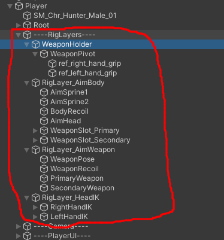</img>  
      *  Multi-Parent Constraint와 Two Bone IK Constraint를 통해 각 종 애니메이션을 **최소의 컴포넌트**로 손쉽게 제작  
          * 실제 캐릭터 rig가 아니라 따로 세팅한 컴포넌트로 애니메이션 제작  
             
            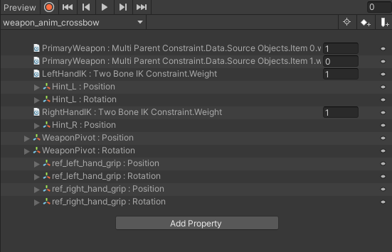</img>  
          * 작업 Gif   
            
            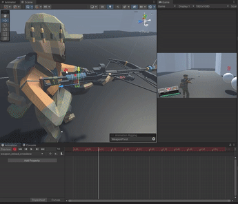</img>  
    * **구현 Gif**  
      *  **반동 및 재장전**  
          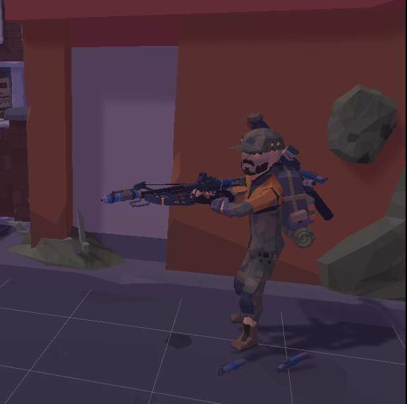</img>  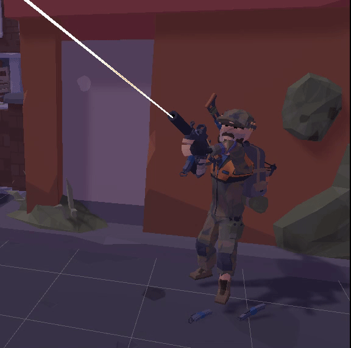</img>  
      *  **스왑**  
          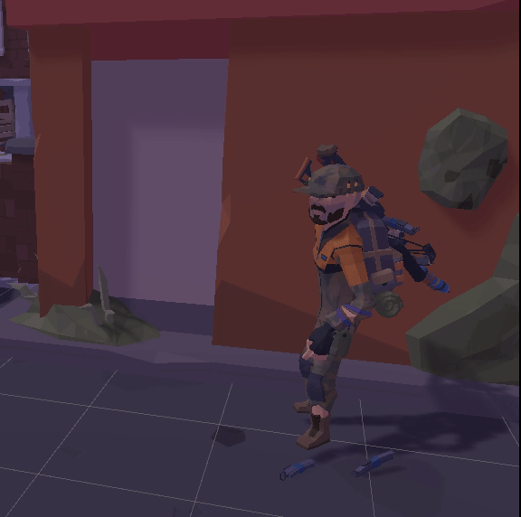</img>  
      *  **무기 장착시 뛰기 모션**  
          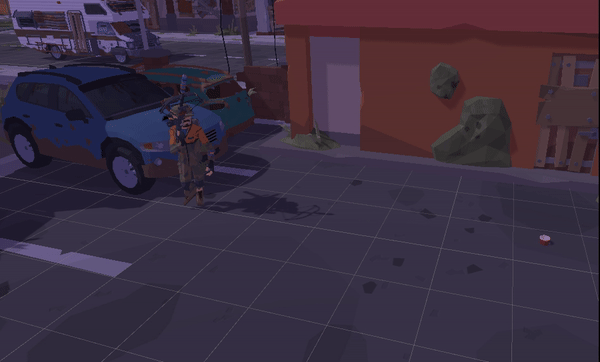</img> 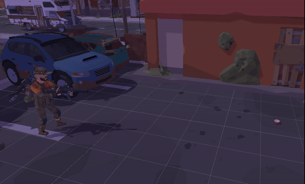</img>   

    * **Animator**  :  일반 석궁과 폭탄 석궁은 공통 모션이기때문에 석궁과 기관총 모션 2세트로 구성
      *  **Base Layer** : 총 스왑 & 재장전 모션    
          *  **Animator**  

              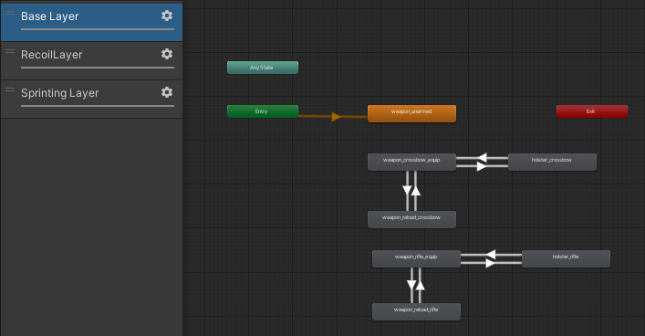</img>  
      *  **Reciol Layer** : 총 반동 모션      
          *  **Animator**  

              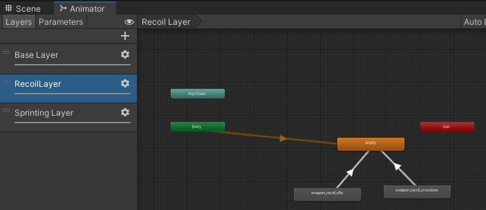</img>  
      *  **Sprinting Layer** : 총 장착 후 달릴때 모션 
          *  **Animator**  

              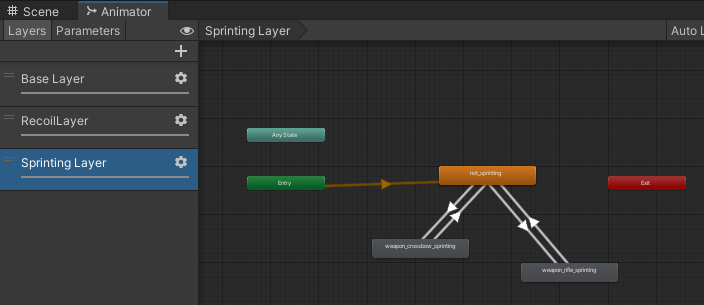</img>  
            

## 게임 로직 및 기능

* **PlayerController.cs**  
  *  **Main Function**  : Update()에서 사용자의 입력에 따라 캐릭터 이동 제어
      *  **void UpdateOnGround()** : (지면) 캐릭터 이동 제어  
          *  Sub Function  
              *  **bool IsSprinting()** : 총 발사, 장전, 스왑, 조준 상태 체크  
                  ```C#
                  return isSprinting && !isFiring && !isReloading && !isChangingWeapon && !isAiming;
                  ```  
              *  **void UpdateIsSprinting()** : bool IsSprinting()를 받아 애니메이션 적용  
              *  **void Jump()** : float jumpVelocity 값 세팅 및 void SetinAir 호출  
              *  **void SetinAir(float jumpVelocity)** : void UpdateInAir()로 전환, 점프 anim 재생.
      *  **void UpdateInAir()** : (공중) 캐릭터 이동 제어    
          *  Sub Function
              *  **Vector3 CalculateAirControl()** : 방향키 입력에 따라 공중에서 움직임 벡터값 설정  
              
  *  **Animation Event Function** : 발걸음에 따라 발자국 소리 재생  
      *  **void insideStep()** : 랜덤 오디오 클립 재생  
          *  **AudioClip GetRandomClip(int a, int b)** : 랜덤 오디오 클립 반환  
  *  **Unity Function** : 유니티에서 제공하는 함수  
      *  **void OnAnimatorMove()** : Root Motion 관리  
      *  **void OnControllerColliderHit(ControllerColliderHit hit)** : 오브젝트가 CharacterController와 충돌시 밀리게 하기 위해 사용   


* **CharacterAiming.cs**  
  *  **Main Function**  : Update()에서 사용자의 입력에 따라 캐릭터 이동 제어
      *  **void HandleAiming()** : 무기 조준 여부에 따라 UI 및 감도 제어    
      *  **void HandleCamMode()** : 단서 찾기 모드 여부에 따라 카메라, UI, 감도 제어 및 ray 생성 및 단서에 근접시 크로스헤어 색 변화  
      *  **void HandleSensitivity()** : 단축키를 통해 마우스 감도 조절      
      *  **void HandleCameraRecoil()** : 조준시 무기 반동 감소  
  *  **Sub Function** : 유니티에서 제공하는 함수  
      *  **void SetSensitivity(float newSensitivity)** : 일반-조준-단서 찾기 모드 진입시 마우스 감도 세팅  


## 개선 사항
* 애니메이션 이벤트 함수 의존성
  * 애니메이션 이벤트 함수 로 스킬 딜레이 및 연계를 제어하는데 의도치않게 모션이 캔슬되는경우(ex 벽으로 대시) 다음 스킬이 안나가는 버그 발생   
    * 시전 시간이 끝나면 관련 변수 초기화로 임시 해결  
* Enemy가 상속성이 없어서 상호작용에 있어서 복잡한 코드 작성  
  *  K_PlayerFire.cs  
      ```
      if (hit.collider.tag == "Enemy")
      {
          N_Enemy enemy = hit.transform.GetComponent<N_Enemy>();
          if (enemy != null)
              {
                  enemy.AddDamage(damage);

              }
          K_Enemy kenemy = hit.transform.GetComponent<K_Enemy>();
          if (kenemy != null)
          {
              kenemy.AddDamage(damage);

          }

          N_MiniBoss1 miniBoss1 = hit.transform.GetComponent<N_MiniBoss1>();
          if (miniBoss1 != null)
              {
                  miniBoss1.AddDamage(damage);
              }

          N_MiniBoss2 miniBoss2 = hit.transform.GetComponent<N_MiniBoss2>();
          if (miniBoss2 != null)
          {
              miniBoss2.AddDamage(damage);
          }
          N_Boss boss = hit.transform.GetComponent<N_Boss>();
          if (boss != null)
              {
                  boss.AddDamage(damage);
              }


      }
      ```  
      * 체력과 데미지를 가하는 함수는 모든 Enemy의 공통된 기능이기 때문에 상속성을 사용하면 보다 간결한 코드가 될 것으로 보임. 

## License

[](https://opensource.org/licenses/MIT)

## Requirement

[Unity 2021.3.5f1 (LTS)](https://unity.cn/release-notes/lts/2020/2020.3.4f1)

