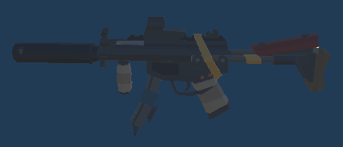
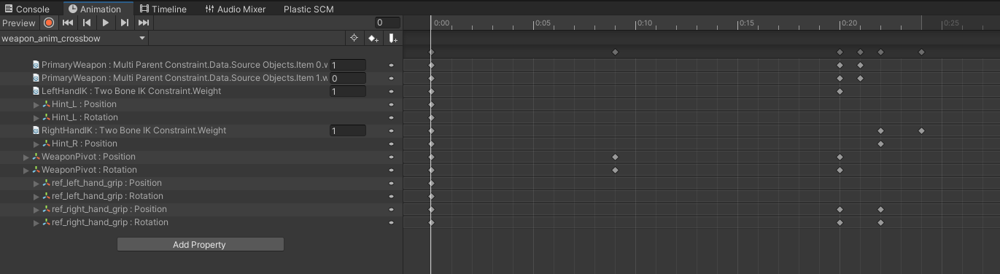

# Rising
메타버스 아카데미 2차 프로젝트(2022.7.26 ~ 2022.8.28)  

## 게임 시연 영상
* Youtube 링크  
  
    [](https://youtu.be/BcmCwdvn-R0)  
      
##  게임  
  * **DEAD RISING**   
      

## 팀 구성 및 역할
     

## 게임 시퀀스
    

## 사용 에셋
  * **[POLYGON Apocalypse](https://assetstore.unity.com/packages/3d/environments/urban/polygon-apocalypse-low-poly-3d-art-by-synty-154193)**  
    </img>  

----
# 주요 구현 요소(김혜성)

## 시네마틱 영상

* **시네머신**  

  * 오프닝 씬  
    </img>  

  * 엔딩 크레딧  
    </img>  
  
## 플레이어

* **플레이어 모델**  
    
    </img>  
* **무기 모델** : (왼쪽부터) 일반 석궁, 폭탄 석궁, 기관총  
  
    </img> </img> </img>    


## 애니메이션 : 캐릭터 애니메이션 & Rig 애니메이션 
  * **캐릭터 애니메이션**  
    *  **Root Motion 사용**  
      *  이전 프로젝트에서는 애니메이션과 위치 이동을 따로 구현하였는데 이번 프로젝트에서는 Root Motion 사용  
      *  Root Motion이 적용된 애니메이션은 애니메이션과 이동속도가 싱크가 맞게 만들어져 있어서 보다 자연스러운 이동 구현 가능  
          (ex 기존에는 발걸음을 옮기기 전인데도 불구하고 위치 이동, 하지만 RootMotion 적용시 정확히 발걸음을 옮겼을시 이동)   
          </img>   
      *  **사전 작업**  
          * 유니티에서 제공하는 애니메이션 콜백함수인 void OnAnimatorMove() 구현  
            ```C#
            private void OnAnimatorMove()
            {
                rootMotion += animator.deltaPosition;
            }
            ```
           *  그리고 (Vector3)rootMotion에 적절한 값을 곱해준후 CharacterController.Move로 해당 값만큼 이동 후 0으로 초기화 시켜준다.(누적 방지)
              ```C#
              private void UpdateOnGround()
              {   
                  Vector3 stepForwardAmount = rootMotion* groundSpeed;
                  //중력
                  Vector3 stepDownAmount = Vector3.down * stepDown;

                  cc.Move(stepForwardAmount + stepDownAmount);
                  rootMotion = Vector3.zero;
              }
              ```  
    *  **Base Layer** : 걷기, 뛰기, 점프  
        *  **Animator**  
          
            </img>  
        * **Unity Blend Tree** : 걷기, 뛰기 State는 Blend Tree로 구성되어 방향키에 따라 자연스러운 움직임  
         
            </img>  
    *  **Aim Layer** : 조준시 카메라 줌 인/줌 아웃  
        *  **Animator**  
          
            </img>  
            
  * **Rig 애니메이션**  
    * **개요**
      *  장착한 무기에 따라 캐릭터의 팔 애니메이션이 다르고 무기와 함께 팔이 움직여야 하기 때문에 RigLayer 세팅  
      
          </img>  
      *  Multi-Parent Constraint와 Two Bone IK Constraint를 통해 각 종 애니메이션을 **최소의 컴포넌트**로 손쉽게 제작  
          * 실제 캐릭터 rig가 아니라 따로 세팅한 컴포넌트로 애니메이션 제작  
             
            </img>  
          * 작업 Gif   
            
            </img>  
    * **구현 Gif**  
      *  **반동 및 재장전**  
          </img>  </img>  
      *  **스왑**  
          </img>  
      *  **무기 장착시 뛰기 모션**  
          </img> </img>   

    * **Animator**  :  일반 석궁과 폭탄 석궁은 공통 모션이기때문에 석궁과 기관총 모션 2세트로 구성
      *  **Base Layer** : 총 스왑 & 재장전 모션    
          *  **Animator**  

              </img>  
      *  **Reciol Layer** : 총 반동 모션      
          *  **Animator**  

              </img>  
      *  **Sprinting Layer** : 총 장착 후 달릴때 모션 
          *  **Animator**  

              </img>  
            

## 게임 로직 및 기능
**플레이어 스크립트**  
* **PlayerController.cs**  : 캐릭터 이동  
  *  **Main Function**  : Update()에서 사용자의 입력에 따라 캐릭터 이동 제어
      *  **void UpdateOnGround()** : (지면) 캐릭터 이동 제어  
          *  Sub Function  
              *  **bool IsSprinting()** : 총 발사, 장전, 스왑, 조준 상태 체크  
                  ```C#
                  return isSprinting && !isFiring && !isReloading && !isChangingWeapon && !isAiming;
                  ```  
              *  **void UpdateIsSprinting()** : bool IsSprinting()를 받아 애니메이션 적용  
              *  **void Jump()** : float jumpVelocity 값 세팅 및 void SetinAir 호출  
              *  **void SetinAir(float jumpVelocity)** : void UpdateInAir()로 전환, 점프 anim 재생.
      *  **void UpdateInAir()** : (공중) 캐릭터 이동 제어    
          *  Sub Function
              *  **Vector3 CalculateAirControl()** : 방향키 입력에 따라 공중에서 움직임 벡터값 설정  
              
  *  **Animation Event Function** : 발걸음에 따라 발자국 소리 재생  
      *  **void insideStep()** : 랜덤 오디오 클립 재생  
          *  **AudioClip GetRandomClip(int a, int b)** : 랜덤 오디오 클립 반환  
  *  **Unity Function** : 유니티에서 제공하는 함수  
      *  **void OnAnimatorMove()** : Root Motion 관리  
      *  **void OnControllerColliderHit(ControllerColliderHit hit)** : 오브젝트가 CharacterController와 충돌시 밀리게 하기 위해 사용   


* **CharacterAiming.cs** : 카메라 제어  
  *  **Main Function**  : Update()에서 사용자의 입력에 따라 카메라 제어
      *  **void HandleAiming()** : 무기 조준 여부에 따라 UI 및 감도 제어    
      *  **void HandleCamMode()** : 단서 찾기 모드 여부에 따라 카메라, UI, 감도 제어 및 ray 생성 및 단서에 근접시 크로스헤어 색 변화  
      *  **void HandleSensitivity()** : 단축키를 통해 마우스 감도 조절      
      *  **void HandleCameraRecoil()** : 조준시 무기 반동 감소  
  *  **Sub Function** : 유니티에서 제공하는 함수  
      *  **void SetSensitivity(float newSensitivity)** : 일반-조준-단서 찾기 모드 진입시 마우스 감도 세팅  

* **AimLookAt.cs** : Multi-Aim Constraint의 Source Objects의 위치를 업데이트하기위한 클래스  
  *  개요 : 캐릭터의 머리, 몸, 총구, 손 등이 해당 컴포넌트가 붙어있는 오브젝트 방향을 바라본다. 
      ```
      transform.position = mainCamera.transform.position+ mainCamera.transform.forward*10;
      ```
      
* **CrossHairTarget.cs** : 총알의 목표지점을 쉽게 GET하기 위한 클래스  
  *  개요 : 총을 쏠때마다 총알마다 총알의 방향(총구 -> RaycastHit.point)를 설정해야하는데 간단하게 RaycastHit.point을 가져오기 위한 클래스  
      ```
      //target은 CrossHariTarget.cs가 붙어있는 오브젝트의 위치  
      Vector3 velocity = (target - raycastOrigin.position).normalized * bulletSpeed;
      ```
      
* **Health.cs** : 플레이어와 좀비의 체력을 관리하는 기반 클래스  
  * **개요** : 플레이어와 좀비가 체력관련 공통 속성과 메소드가 있기때문에 확장성을 고려하여 기반클래스-파생클래스 개념 적용  
  *  **Main Function**  
      *  **void TakeDamage(float amount, Vector3 direction)** : 데미지를 받는 메소드  
      *  **void Die(Vector3 direction)** : 체력이 0일때 사망하는 기능  
  *  **virtual Function**  
      *  **void OnStart()** : 객체가 태어났을때 체력과 히트박스, SkinnedMeshRenderer 등 컴포넌트를 등록하는 가상 함수  
      *  **void OnUpdate()** : (좀비 한정) 좀비가 데미지를 입을때 SkinnedMeshRenderer가 변하는데 시간에 따른 색조정이 필요하여 void Update()에 구현  
      *  **void OnDamage(float amount, Vector3 direction)** : 데미지를 입었을때 체력이 감소하는것과 데미지를 입어 체력이 0이하가 되었을때 사망하는것은 공통으로 구현, 플레이어 체력바 업데이트 및 좀비 타격 이펙트는 따로 구현  
      *  **void OnDeath(Vector3 direction)** : 플레이어와 좀비는 사망 메커니즘이 다르기 때문에 파생클래스에서 구현  


* **PlayerHealth.cs** : 플레이어 체력 파생 클래스  
  *  **override Function**  
      *  **void OnStart()** : 체력바 세팅  
      *  **void OnUpdate()** : -  
      *  **void OnDamage(float amount, Vector3 direction)** : 체력바 업데이트  
      *  **void OnDeath(Vector3 direction)** : -  

* **PlayerUI.cs** : 플레이어 체력 UI 및 무기 UI 제어  
  *  **Function**  
      *  **void Refresh(int ammoCount, int clipCount, int activeWeaponIndex, bool uninfinitybullet)** : 총알 및 탄창 UI 업데이트  
      *  **void ActiveSlotUI(int index), void DeactiveSlotUI()** : 무기 장착시 무기 UI 아웃라인 표시 메소드   
      *  **void SetHealthBarPercentage(float percentage)** : 체력바 UI 업데이트  

* **PlayerEXP.cs** : 플레이어 경험치 및 경험치 UI 제어  
  *  **property**  
      *  **int KillNum** : 좀비 처치시 증가  
      *  **int KillPerLevel** : 경험치바를 위해 만든 property, 레벨업시 0으로 초기화, KillPerLevel / 레벨업 필요 경험치량을 계산하여 경험치바 증가  
          *  **void SetEXPBarPercentage(float percentage)** : 경험치바 UI 관리  
      *  **int Level** : 플레이어 레벨  
      
* **ActiveWeapon.cs**  : 무기 컨트롤러  
  *  **Main Function**  : Update()에서 사용자의 입력 및 캐릭터 속성(레벨 등)에 따라 무기를 관리하는 함수  
      *  **void HandleFireWeapon()** : 무기 발사와 장전 제어      
      *  **void HandleSwapWeapon()** : 무기 스왑 제어    
      *  **void UpgradeWeaponSystem()** : 레벨에 따른 무기 업그레이드 관리        

  *  **Sub Function**  
      *  **RayCastWeapon1 GetActiveWeapon() / GetWeaPon(int index)** : 무기 객체를 가져오는 함수     
      *  **void Equip(RayCastWeapon1 newWeapon, bool equipNow=true)** : 무기를 얻는 함수, 얻자마자 장착할 여부 선택 가능       
      *  **void SetActiveWeapon(WeaponSlot weaponSlot)** : SwitchWeapon 전달인수 세팅 및 코루틴 실행
          *  **IEnumerator SwitchWeapon(int holsterIndex, int activateIndex)**  
              : rig 애니메이션 파라미터 세팅 및 HolsterWeapon,ActivateWeapon코루틴 순차적 실행, activeWeaponIndex 세팅  
              * **IEnumerator HolsterWeapon(int index)** : 무기 배낭에 보관 기능, 애니메이션 및 변경 중 bool 값 세팅  
              * **IEnumerator ActivateWeapon(int index)** : 무기 장착 기능, 애니메이션 및 변경 중 bool 값 세팅, 무기 활성화 UI 표현       
      *  **void RefillAmmo(int clipCount),(RayCastWeapon1 weapon ,int clipCount)** : 무기 탄창 추가 및 UI 업데이트  
      *  **IEnumerator ToggleActiveWeapon()** : 맨손 상태로 전환하는 함수  
      *  **void EquipFirstWeapon()** : 처음 플레이어가 생성됐을때 기본무기를 장착하는 함수  
      *  **bool IsFiring()** : 현재 무기 발사중인지 체크하는 함수  

* **ReloadWeapon.cs**  : 무기 반동 제어  
  *  **Animation Event Function**  : 애니메이터와 스크립트가 동일객체에 있어야 애니메이션 이벤트 함수로 등록할수있는데 플레이어는 2개의 애니메이터를 가지고 있다.
      **ReloadWeapon.cs**스크립트는 플레이어에 있어야하지만(관리적인 측면) 여기의 함수는 rig 애니메이터의 이벤트함수로 등록해야한다. 그래서 rig오브젝트에는 **WeaponAnimationEvents.cs**를 붙여준뒤 UnityEvent 기능을 활용하여 AddListener(OnAnimationEvent)로 **ReloadWeapon.cs**에 있는 함수들을 이벤트함수로 등록할 수 있게 해주었다.    </img>
      *  **void OnAnimationEvent(string eventName)** : 매개변수에 따라 스위치문을 통해 이벤트 함수 실행.  
          *  **void DetachMagazine()** : 탄창 분리 기능(원래 무기에 붙어있는 탄창을 비활성화 후 임시 탄창을 손 위치에 생성한다), 장전 소리 재생.    
          *  **void DropMagazine()** : 탄창 버리는 기능(손에 있는 탄창을 비활성화 후 떨어지는 탄창을 생성 후 떨어지게 한다(rigidbody 및 collider 추가))        
          *  **void RefillMagazine()** : 배낭에서 탄창을 꺼내는 기능(손에 있는 탄창을 활성화 한다.)   
          *  **void AttachMagazine()** : 총기에 탄창을 붙이는 기능(손에 있는 탄창을 비활성화하고 원래 무기에 붙어있는 탄창을 활성화한다. 애니메이션 파라미터 초기화 후 UI를 업데이트 해준다.)  


**무기 스크립트**  
* **RayCastWeapon1.cs**  : **무기 구현 스크립트**  
  * **Main Function**  : **ActiveWeapon.cs**의 Update()에서 호출하는 함수  
    * **void UpdateWeapon(float deltaTime, Vector3 target)** : 발사 기준 시간 업데이트  
      * **void UpdateFiring(float deltaTime, Vector3 target)** : 발사 기준시간과 연사율 비교하여 총알 발사  
      * **void FireBullet(Vector3 target)** : 총알 생성, 총구 이펙트 및 사운드, 총알 개수 감소 적용
      * **Bullet CreateBullet(Vector3 position, Vector3 velocity)** : 총알 발사 위치, 속도, 시간, traileffect 세팅된 총알 반환.  
    * **void UpdateBullets(float deltaTime)** : 총알 업데이트    
      * **void SimulateBullet(float deltaTime)** : 총알마다 시간 속성 업데이트  
      * **Vector3 GetPosition(Bullet bullet)** : 시간에 따른 총알 위치 업데이트  
      * **void RaycastSegment(Vector3 start, Vector3 end, Bullet bullet)** : 업데이트된 위치를 기반으로 레이 발사, 타격 이펙트, 좀비에게 데미지 가하는 기능.  
  * **Sub Function**  
    * **void StartFiring()** : (bool)isFiring = true, 발사 기준 시간 초기화, 반동 초기화  
    * **void StopFiring()** : (bool)isFiring = false  


* **WeaponRecoil.cs** : **무기 반동 스크립트**,  관련 속성들은 **ActiveWeapon.cs**에서 무기 장착시 할당한다.   
  * **Main Function**  : Update()에서 호출하는 함수  
    * **HandleWeaponRecoil()** : 카메라 축과 반동 시간을 제어하는 함수  
  * **Sub Function**  
    * **void GenerateRecoil(string weaponName)** : 시네머신관련 컴포넌트 **CinemachineImpulseSource**에서 카메라 효과 생성 및 반동 값 적용, 반동 애니메이션 재생  
    * **int NextIndex(int index)** : 다음 반동값 return함수  
    * **Reset()** : 반동 초기화  

* **Inspector**  
  </img>  
  
**기타 스크립트**  
* **CustomBullet.cs** : 폭탄 석궁의 딜레이 폭발 탄환 구현 스크립트     
  *  **Function**  
      *  **void TimeCaculation()** : lifeTime 계산 및 타격 오브젝트에 붙어서 이동하게 하는 메소드  
      *  **void Explode()** : Physics.OverlapSphere를 통해 폭발 범위내 좀비 GET 후 폭발 피해 및 이펙트, 사운드 생성  
      *  **void OnTriggerEnter(Collider other)** : 폭발탄환이 붙을 오브젝트 등록  
      *  **void OnDrawGizmosSelected()** : unity editor에서 폭발 범위를 조정하기 위해 사용  

* **CarEnterExitSystem.cs** : 폭탄 석궁의 딜레이 폭발 탄환 구현 스크립트     
  *  **Function**  
      *  **IEnumerator StartDrive()** : 자동차 탑승 메소드  
      *  **void ExitCar()** : 자동차 하차 메소드  
      *  **void CarSFX(AudioClip clip)** : 자동차 사운드 관리 메소드  
          *  **void CarDrivingSFX(AudioClip clip)** : 엔진음  
          *  **void CarFiringSFX()** : 차량 화염방사기 사운드  
      *  **void OnTriggerEnter(Collider other), void OnTriggerExit(Collider other)** : 차량 탑승 가능 여부 판별  

* **ItemPickup.cs** : 충돌시 아이템 획득 스크립트   

* **KeyItem.cs** : 미션 아이템 감지 범위 제어 스크립트  

* **SoundManager.cs** : 배경음 관리 스크립트  
  *  **Function**  
      *  **void OnSceneLoaded(Scene arg0, LoadSceneMode arg1)** : 해당 메소드를 SceneManager.sceneLoaded의 Unity Action에 등록, 씬 전환시 자동으로 호출  
          *  **void BGSoundPlay(AudioClip clip)** : 배경음 세팅 메소드  


## 개선 사항  
* 1차 프로젝트(RETAKE)에서 체력관련 클래스에 상속 클래스를 사용하지 않아서 발생한 문제를 이번 프로젝트에서는 개선  
* 차량 탑승 전후로 rig 애니메이션이 변형이 발생 -> 차량 탑승시 Player.transform.SetParent(Car);으로 플레이어의 부모객체를 차량으로 만들고 비활성화하는데 이때 애니메이션이 초기화가 안되어서 애니메이션에 변형이 일어나는것으로 보임  
* 일반석궁 장전중에 폭발 석궁으로 업그레이드가 발생시(아이템 획득 or 레벨업) 폭발 석궁 총알이 감소 -> 


## License

[](https://opensource.org/licenses/MIT)

## Requirement

[Unity 2021.3.5f1 (LTS)](https://unity.cn/release-notes/lts/2020/2020.3.4f1)

